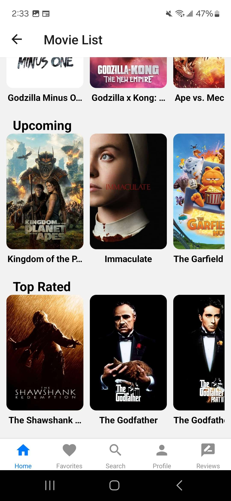

# INF657-Final-Project - Movie List App: A Movies

The project "A Movies" is a React Native app where users can browse a list of movies, save their favorite movies to a favorites tab, and write reviews for the movies they watched. I used themoviesdb (TMDB) API to fetch real-tiem data about movies. Users can sign up and log in using their email and password thanks to Firebase authentication. I also used Firestore database to handle user data and reviews. Async Storage is also used for storing user favorited movies as a change. In addition, there is a search functionality. The app uses bottom tab and stack navigation to navigate between screens.

## Features

- User Authentication: Signup and Login Screens to allow users using email and password with Firebase authentication
- Movie Listings: Browse movies by categories fetched from TMDB API
- Detailed Movie Insights: Access detailed information about each movie such as synopsis, runtime, and similar movies and allow users to write a review for the movie
- Favorites: Users can add movies to their favorites tab (like a saved/watch list)
- Profile: Users can view and edit their profile like give themself a display name
- Reviews: Users can write personal reviews about movies with a title, note, and rating.
- Search Functionality: Search for movies based on titles
- ...

## Prerequisites

- React Native
- Firebase
- JavaScript
- Expo

## Setup

1. Clone the repository using: `git clone https://github.com/HernandezA1007/INF657-Final-Project.git`.
2. Navigate to the project directory and install the dependencies: `npm install` or do similar with expo, npx, and yarn
3. Launch the application using `expo start` or npx expo start and use android or iphone to test the app
4. You will most likely need to create your own firebase project and replace my config/firebase and get your own TMDB API key for utils/api

- Have not gotten to deploying via Firebase..

## Development Roadmap

- [x] Signup Screen
- [x] Login Screen
- [x] Firebase Authentication
- [x] Stack Navigation
- [x] Movie Listing
- [x] Detailed Movie Information
- [x] Heart Icon
- [x] FlatList Component
- [x] Firebase Realtime Database
- [x] Favorites Feature
- [x] Profile Page
- [x] Review Screen
- [x] Bottom Tab Navigation
- [ ] Drawer Navigation

## Gallery

IPhone View
|  |  |
|:---:|:---:|
|  |  |
|:---:|:---:|
|  |  |

Android View
|  |  |
|:---:|:---:|
|  |  |

(no web view available)

## Future Work

1. Drawer Navigation
2. Deploy via Firebase
3. Enhance each screen
4. Dark mode/theme
5. More categories/genre
6. More details for movies
7. Make more use of the API features
8. Add more modern and popular mobile features
